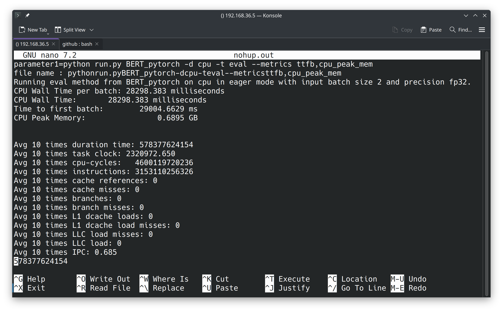

# PyTorch Benchmark教程

## 前言

首先你需要安装好PyTorch RISC-V和相关依赖，PyTorch安装教程[看这里](./tutorial-oe-cn.md)。
本教程仍然按照前PyTorch教程进行安装。

## 安装`torchvision`

这里本人偷个懒哈，直接采用现有的wheel。
感谢[KumaTea](https://github.com/KumaTea)提供的wheel。
项目地址：[https://github.com/KumaTea/pytorch-riscv64](https://github.com/KumaTea/pytorch-riscv64)

```bash
source ~/venv/bin/activate
pip install https://github.com/KumaTea/pytorch-riscv64/releases/download/2.1/torchvision-0.16.1-cp311-cp311-linux_riscv64.whl
```

也可下载后传到服务器再安装。

之所以不用他的wheel安装`pytorch`，是因为他并未解决`cpuinfo`的问题，导致`Unknown CPU`的报错。

但`torchvision`的wheel可以无缝衔接我们的`pytorch`环境。

## 安装`torchaudio`

首先下载release：

```bash
wget https://github.com/pytorch/audio/archive/refs/tags/v2.3.1.tar.gz
tar xvf v2.3.1.tar.gz
cd audio-2.3.1
```

看了下`requirements.txt`，可知除了torch其余均为可选依赖，因此我们可以直接安装。
编辑`packaging/torchaudio/build.sh`文件，在第二行下加入：
```bash
export _GLIBCXX_USE_CXX11_ABI=1 
export USE_CUDA=0
export USE_DISTRIBUTED=0
export USE_MKLDNN=0
export MAX_JOBS=5 # 编译任务数
export USE_FFMPEG=0 # 禁止使用ffmpeg
```

然后运行：

```bash
source ~/venv/bin/activate
bash ./packaging/torchaudio/build.sh
```

编译需要花费一定的时间，可等待片刻，可考虑挂在`screen`或`tmux`后台运行。

## 启动`benchmark`

编辑`torchbenchmark/_components/model_analyzer/TorchBenchAnalyzer.py`文件。

将前16行的`from xxx import xxx`中包含GPU的import**全部注释**。

撰写脚本：

```bash
source ~/venv/bin/activate
export HF_ENDPOINT=https://hf-mirror.com # Hugging Face模型镜像
perf stat --sync -e duration_time,task-clock,cycles,instructions,cache-references,cache-misses,branches,branch-misses,L1-dcache-loads,L1-dcache-load-misses,LLC-load-misses,LLC-loads -r 1 -o performance.txt "python run.py BERT_pytorch -d cpu -t eval --metrics ttfb,cpu_peak_mem"
```

将其保存为`run.sh`，并运行：

```bash
bash ./run.sh
```

其中`BERT_pytorch`为模型名称，`-d cpu`指定在CPU上运行，`-t eval`指定测试模式，`--metrics ttfb,cpu_peak_mem`指定测试指标。

跑的时间比较长，建议挂在`screen`或`tmux`后台运行。

输出类似于：


`perf`命令用于分析程序的性能，`-e`参数指定要分析的事件，`-r`参数指定运行次数，`-o`参数指定输出文件。
