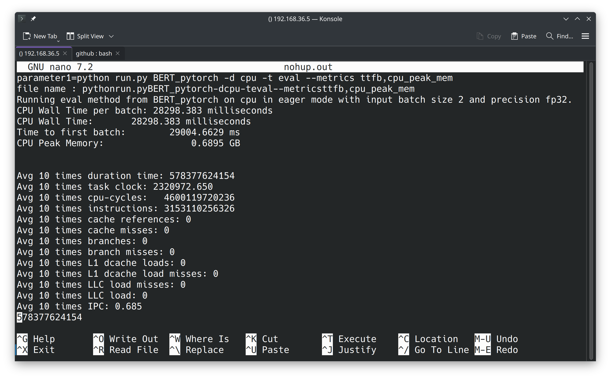

# PyTorch Benchmark Tutorial

## Introduction

First, you need to install PyTorch RISC-V and related dependencies. For PyTorch installation instructions, refer to [this tutorial](./tutorial-oe-en.md). This tutorial follows the installation steps from the previous PyTorch tutorial.

## Install `torchvision`

For simplicity, we will use an existing wheel. Thanks to [KumaTea](https://github.com/KumaTea) for providing the wheel. Project address: [https://github.com/KumaTea/pytorch-riscv64](https://github.com/KumaTea/pytorch-riscv64)

```bash
source ~/venv/bin/activate
pip install https://github.com/KumaTea/pytorch-riscv64/releases/download/2.1/torchvision-0.16.1-cp311-cp311-linux_riscv64.whl
```

Alternatively, you can download it and upload it to the server before installing.

We are not using his wheel for installing `pytorch` because it does not resolve the `cpuinfo` issue, which causes an `Unknown CPU` error.

However, the `torchvision` wheel can seamlessly integrate with our `pytorch` environment.

## Install `torchaudio`

First, download the release:

```bash
wget https://github.com/pytorch/audio/archive/refs/tags/v2.3.1.tar.gz
tar xvf v2.3.1.tar.gz
cd audio-2.3.1
```

Looking at the `requirements.txt` file, we can see that apart from torch, all other dependencies are optional, so we can install directly.
Edit the `packaging/torchaudio/build.sh` file, and add the following lines after the second line:

```bash
export _GLIBCXX_USE_CXX11_ABI=1 
export USE_CUDA=0
export USE_DISTRIBUTED=0
export USE_MKLDNN=0
export MAX_JOBS=5 # Number of compilation tasks
export USE_FFMPEG=0 # Disable using ffmpeg
```

Then run:

```bash
source ~/venv/bin/activate
bash ./packaging/torchaudio/build.sh
```

Compilation will take some time, so you can wait for a while, or consider running it in the background using `screen` or `tmux`.

## Start `benchmark`

Edit the `torchbenchmark/_components/model_analyzer/TorchBenchAnalyzer.py` file.

**Comment out** all the `from xxx import xxx` imports containing GPU within the first 16 lines.

Write the following script:

```bash
source ~/venv/bin/activate
export HF_ENDPOINT=https://hf-mirror.com # Hugging Face model mirror
perf stat --sync -e duration_time,task-clock,cycles,instructions,cache-references,cache-misses,branches,branch-misses,L1-dcache-loads,L1-dcache-load-misses,LLC-load-misses,LLC-loads -r 1 -o performance.txt "python run.py BERT_pytorch -d cpu -t eval --metrics ttfb,cpu_peak_mem"
```

Save it as `run.sh`, and run:

```bash
bash ./run.sh
```

Where `BERT_pytorch` is the model name, `-d cpu` specifies running on the CPU, `-t eval` specifies evaluation mode, and `--metrics ttfb,cpu_peak_mem` specifies the metrics to be tested.

The execution time is quite long, so it is recommended to run it in the background using `screen` or `tmux`.

The output will look similar to:


The `perf` command is used to collect performance statistics, and the output is saved in the `performance.txt` file.
