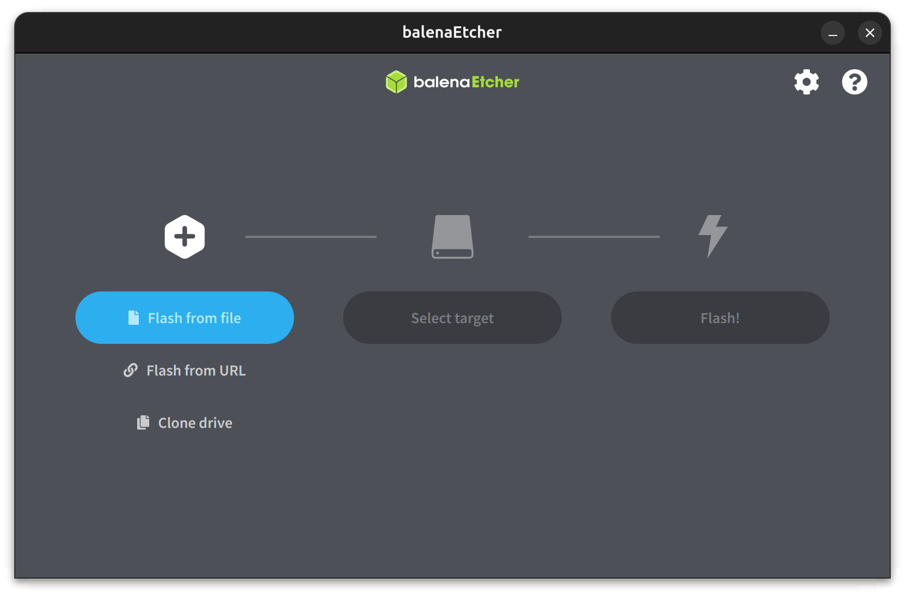
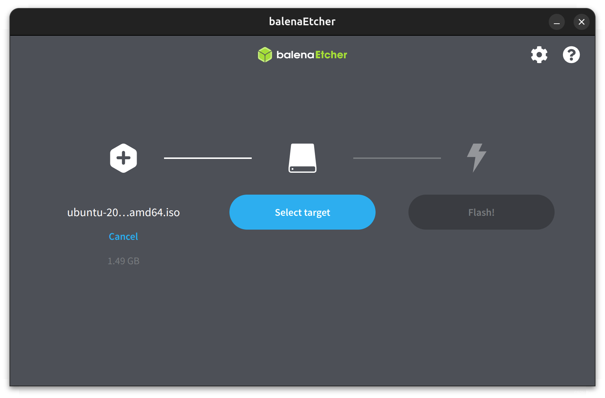
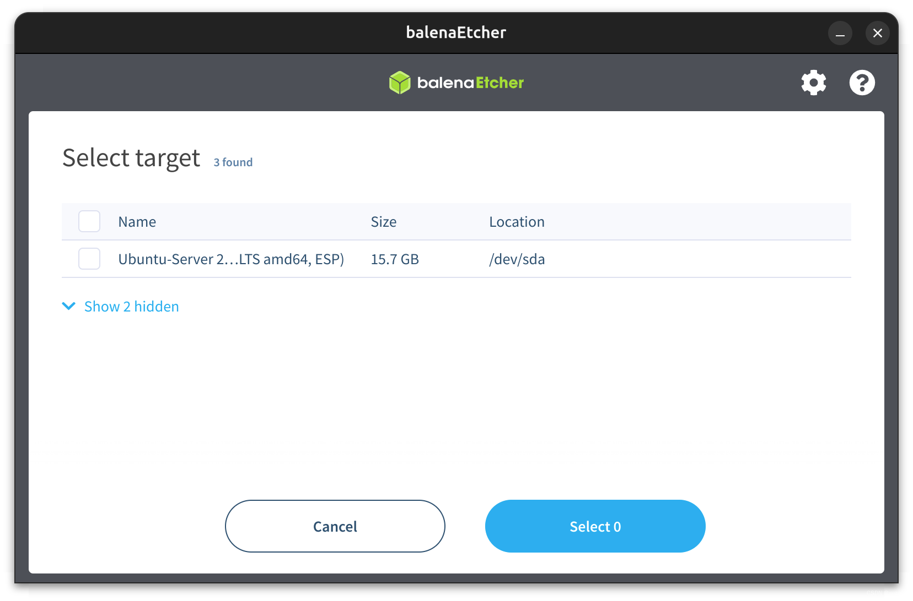
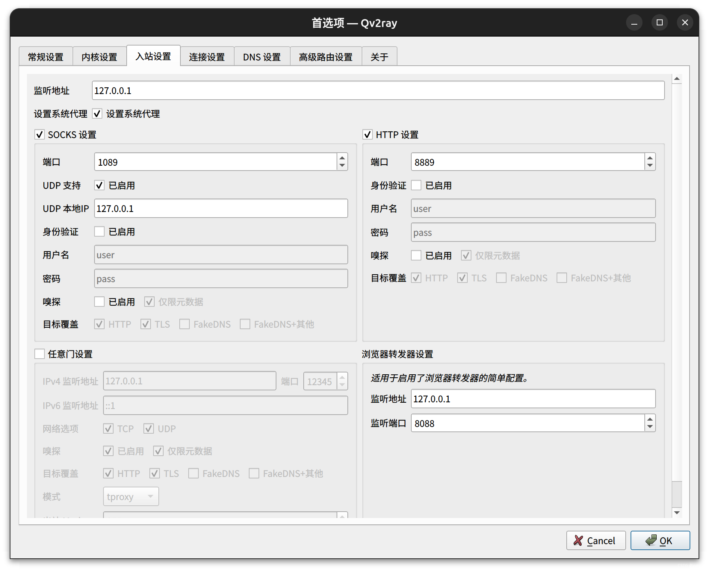
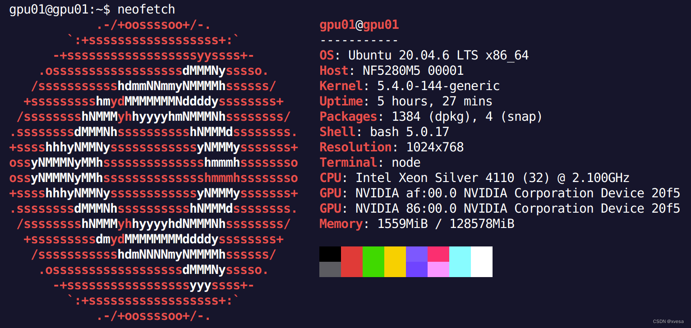
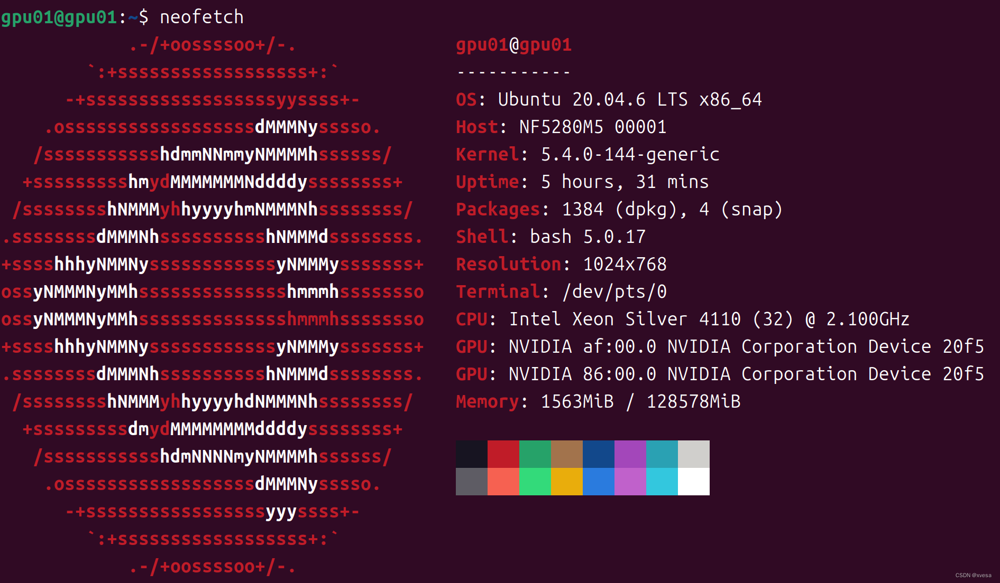
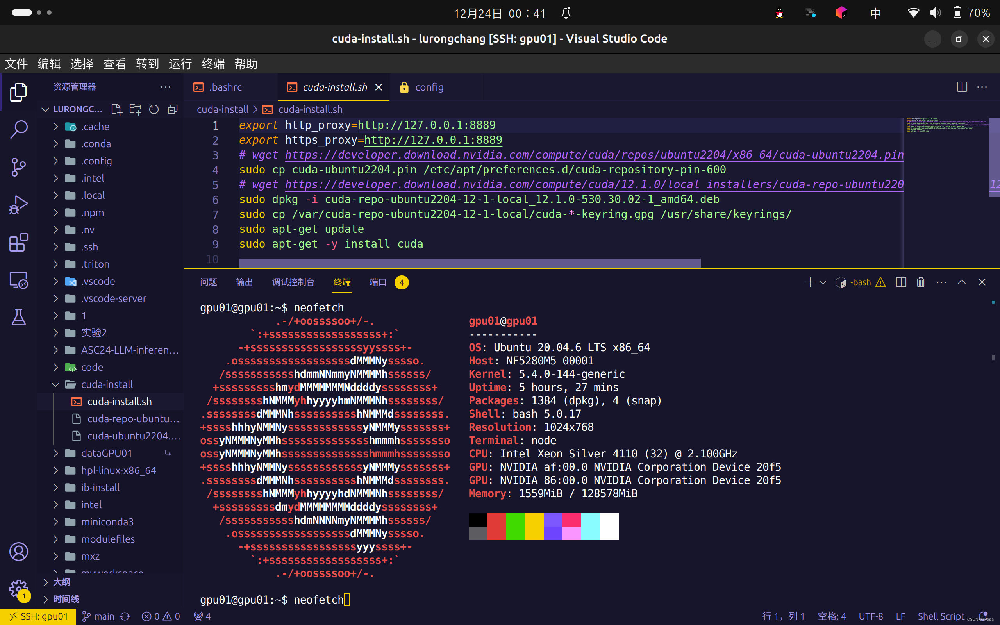

@[TOC](『HPC运维点滴』第01期)
# Ubuntu Server 20.04集群网络配置
## 第一步：烧录镜像
### 1. 下载镜像
前往开源软件镜像站下载Ubuntu Server 20.04镜像，以下地址选择一种：
- 中国科学技术大学开源软件镜像站[下载地址](https://mirrors.ustc.edu.cn/ubuntu-releases/20.04.6/ubuntu-20.04.6-live-server-amd64.iso)
- 北京外国语大学软件镜像站[下载地址](https://mirrors.bfsu.edu.cn/ubuntu-releases/20.04.6/ubuntu-20.04.6-live-server-amd64.iso)
- 清华大学软件镜像站[下载地址](https://mirrors.tuna.tsinghua.edu.cn/ubuntu-releases/20.04.6/ubuntu-20.04.6-live-server-amd64.iso)
### 2. 使用烧录工具
推荐使用BalenaEtcher工具，点击前往[官网](https://etcher.balena.io/)。下载安装后打开此软件：
点击```Flash from file```，选择下载的镜像。
点击```Select target```，选择你的U盘。
最后点击```Flash!```将镜像烧录至U盘。

## 第二步：安装过程
我们的机器是浪潮服务器节点，开机自检时间较长。点按电源键开机，并接上键盘与VGA显示屏。启动时当出现浪潮启动界面时按下F11，当提示```Entering boot menu ...```时，说明启动完成之后将打开启动菜单。
经过4～6分钟的等待，屏幕出现了蓝底白字的多启动菜单，使用上下间选中自己的U盘并回车，出现GRUB多启动菜单时亦按回车。
之后由于是服务器实体机安装且安装过程中未拍照，所以安装过程不再详细赘述，可参考其他文章关于Ubuntu Server 20.04系统的安装教程。
[实例教程](https://blog.csdn.net/qq_37837432/article/details/123018187?ops_request_misc=%257B%2522request%255Fid%2522%253A%2522170334543916800211547675%2522%252C%2522scm%2522%253A%252220140713.130102334..%2522%257D&request_id=170334543916800211547675&biz_id=0&utm_medium=distribute.pc_search_result.none-task-blog-2~all~baidu_landing_v2~default-5-123018187-null-null.142%5Ev96%5Econtrol&utm_term=ubuntu20.04server%E7%89%88%E6%9C%AC%E5%AE%89%E8%A3%85&spm=1018.2226.3001.4187)
## 第三步：网络配置
由于我们的集群网络不支持IPv6，故可把IPv6禁用。
```bash
sudo nano /etc/sysctl
```
在最后一行添加：
```bash
net.ipv6.conf.all.disable_ipv6 = 1
```
最后执行
```bash
sudo sysctl -p /etc/sysctl
```
配置netplan
```bash
sudo nano /etc/netplan/*.yaml
```
改成形如以下形式：
```yaml
# This is the network config written by 'subiquity'
network:
  ethernets:
    eno1:
      dhcp4: false
      addresses: [192.168.0.131/24]
      optional: true
      gateway4: 192.168.0.254
    eno2:
      dhcp4: true
    eno3:
      dhcp4: true
    eno4:
      dhcp4: true
  version: 2
```
> 注意：```eno1```等为网卡名称，由于本集群有四个网口，而此处配置的是```eno1```，则需将网线接在1号网口上，其余以此类推。
> ```addresses```中```gateway4```改为自己所在集群网络内网关地址。

以同样的方式，配置四个节点，并将IP地址改为相应。四个节点IP分布如下：
```bash
# ip-address hostname
192.168.0.131 gpu01
192.168.0.132 gpu02
192.168.0.133 gpu03
192.168.0.134 gpu04
```
将其加入到```/etc/hosts```当中。
每个节点配置好之后，
```bash
sudo netplan apply
```
并使用```ip address```命令来查看IP地址。输出类似下面：
```bash
1: lo: <LOOPBACK,UP,LOWER_UP> mtu 65536 qdisc noqueue state UNKNOWN group default qlen 1000
    link/loopback 00:00:00:00:00:00 brd 00:00:00:00:00:00
    inet 127.0.0.1/8 scope host lo
       valid_lft forever preferred_lft forever
    inet6 ::1/128 scope host 
       valid_lft forever preferred_lft forever
2: eno1: <BROADCAST,MULTICAST,UP,LOWER_UP> mtu 1500 qdisc mq state UP group default qlen 1000
    link/ether 6c:92:bf:a8:04:e0 brd ff:ff:ff:ff:ff:ff
    inet 192.168.0.132/24 brd 192.168.0.255 scope global eno1
       valid_lft forever preferred_lft forever
    inet6 fe80::6e92:bfff:fea8:4e0/64 scope link 
       valid_lft forever preferred_lft forever
3: eno2: <NO-CARRIER,BROADCAST,MULTICAST,UP> mtu 1500 qdisc mq state DOWN group default qlen 1000
    ...
```
其中```eno1```下面的```inet```附近即为本节点IP，所示IP与配置一致。
最后```ping```一下其他节点，若可访问，则联网成功。
## 第四步：跳板机登陆与本地代理
修改用户目录下的```.ssh/config```，以下为本人的示例：
```sh
Host 111.115.201.221
  HostName 111.115.201.221
  User root
  RemoteForward 8889 127.0.0.1:8889

Host gpu01
  HostName gpu01
  User gpu01
  ProxyCommand ssh -W %h:%p 111.115.201.221
  RemoteForward 8889 127.0.0.1:8889

Host gpu02
  HostName gpu02
  User gpu02
  ProxyCommand ssh -W %h:%p 111.115.201.221
  RemoteForward 8889 127.0.0.1:8889

Host gpu03
  HostName gpu03
  User gpu03
  ProxyCommand ssh -W %h:%p 111.115.201.221
  RemoteForward 8889 127.0.0.1:8889

Host gpu04
  HostName gpu04
  User gpu04
  ProxyCommand ssh -W %h:%p 111.115.201.221
  RemoteForward 8889 127.0.0.1:8889
```
这里每个```User```字段均改为自己想要的用户名。```RemoteForward```为远端发送，将本地端口反向代理到服务机端，从而实现本地代理。
配置远端发送前先配置好本地代理服务器，本人这里是以```Qv2ray```为GUI前端管理的本地代理，在设置中调整好代理端端口号。
注意```8889```是本人设立的端口号，可根据自己的需求更改，当然这时对应位置都需要修改为自己的端口号。
最后远程登入时，在跳板机设立以下```.ssh/config```（可选）：
```bash
Host gpu01
    HostName gpu01
    User gpu01
    RemoteForward 8889 127.0.0.1:8889
  
Host gpu02
    HostName gpu02
    User gpu02
    RemoteForward 8889 127.0.0.1:8889
  
Host gpu03
    HostName gpu03
    User gpu03
    RemoteForward 8889 127.0.0.1:8889
  
Host gpu04
    HostName gpu04
    User gpu04
    RemoteForward 8889 127.0.0.1:8889
```
这里每个```User```等字段均改为自己想要的用户名，端口号亦改为自己的。
最后在```~/.bashrc```中加入：
```bash
alias setup_proxy="export http_proxy='http://127.0.0.1:8889'; export https_proxy='http://127.0.0.1:8889'"
alias remove_proxy="unset http_proxy; unset https_proxy"
setup_proxy
```
然后登陆前先
```bash
source ~/.bashrc
```
即可享受本地代理所带来的便捷。
此时在shell中，可使用```setup_proxy```来启用代理，使用```remove_proxy```来暂停代理。
```apt```包管理器需要另外配置代理。
在```/etc/apt/apt.conf```中加入：
```c++
Acquire::http::proxy "http://127.0.0.1:8889";
Acquire::https::proxy "http://127.0.0.1:8889";
```
就可以通过代理使用apt包管理器。

> 实际上，此处使用本地代理是为了解决远程服务器的联网问题（例如无法下载某文件等），如无此需求可移除```.ssh/config```中```RemoteForward```字段且无需配置代理。

最后献上一幅服务器配置图吧，让我们有情登场的嘉宾 - ```neofetch```：
```bash
sudo apt install neofetch
```



## 闲杂与安利时间
上面那个截图是本fw用大名鼎鼎的```Visual Studio Code```远程登录后所截取的图。至于为什么不用本人用的Ubuntu自带Terminal？好好好，咱来上一个。
额，属实难绷，行间距太大，看起来LOGO直接变椭圆形，有点丑哦（小小的吐槽下
本fw为啥闲来没事写介个东西：最近正好也在整HPC集群运维啦，踩了无数坑，于是在这马克思哲学原理的考试前两天时间手肝此文（也庆祝看到这里的小伙伴们，逢考必过，期末加油！（顺便水点时间和字数
本人爱好高性能、深度学习、软件开发、计算机视觉、操作系统、编译原理等方面，还请各位大佬多多指教！
顺便安利一下本fw的```VSCode```主题（
装上以下几个插件即可享用！
1. ```Shades of Purple```
2. ```Material Icon Theme```
3. ```FiraCode font - Professional Font for Developers```

那么本期文章就到这里了，咱下期不见不散 ！;-)
