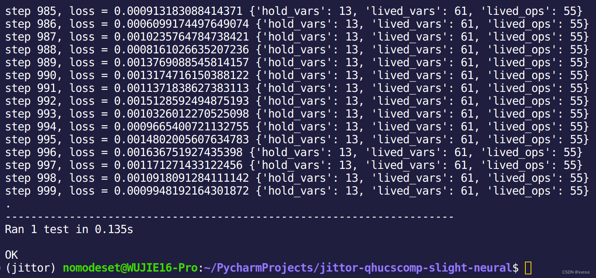

@[TOC](Ubuntu下Jittor环境搭建)
# 前言
计图框架（Jittor），作为新兴国产深度学习框架，其优秀的JIT等方面性能指标排在Pytorch等框架之前列。然而，其对新版本系统环境不甚兼容，官方甚至推荐CUDA 11.2 + Ubuntu 18.04。本教程旨在帮助大家在新如CUDA 12.4 + Ubuntu 23.10系统环境中也仍旧搭建起Jittor环境，以便更好的推进国产深度学习框架的发展。
# 操作步骤
## 步骤1：装好Ubuntu环境与新版本CUDA
Ubuntu可使用WSL或真机安装，不推荐虚拟机，版本从18.04到24.04均可。
CUDA版本可11.2～12.4。
按照网络教程装好最新版miniconda（anaconda亦可，只是miniconda空间更小），官方地址[点击此处](https://docs.anaconda.com/free/miniconda/index.html)，并保证已进入conda环境。conda可按情况换源。
## 步骤2：创建环境并安装Jittor
[官方教程](https://github.com/Jittor/jittor)是在全局环境中安装的，而我们需要创建一环境后安装。
创建环境：
```bash
conda create -n jittor python==3.9
```
此处```jittor```为环境名，若取其他名字可相应改变。
Python版本**强烈推荐**```3.9```版本，其他版本或许可以，但可能会出现一系列问题。
创建后启动环境：
```bash
conda activate jittor
```
在此环境下使用pip安装jittor，注意**强烈推荐**```1.3.8.5```版本：
```bash
pip install jittor==1.3.8.5
```
## 步骤3：踩坑与配置环节
首先，一定要在环境中安装低版本g++，否则可能出现AssertError的问题：
```bash
conda install -c conda-forge gxx=8 mpich
```
其次，使用```python -m jittor_utils.install_cuda```装好cuda后配置好环境变量：
```bash
export nvcc_path=/home/nomodeset/.cache/jittor/jtcuda/cuda11.2_cudnn8_linux/bin/nvcc
```
以我为例，跑```test_cuda```测试时报错会出现此种带有nvcc与cuda11.2的路径，将此路径设置为环境变量，可放在```~/.bashrc```。此处路径改为自己的即可。
最后，执行下列命令进行测试：
```bash
python -m jittor.test.test_example
```
本人运行之截图：
若见最后一行之```OK```，证明已成功通过测试，环境配置成功！


